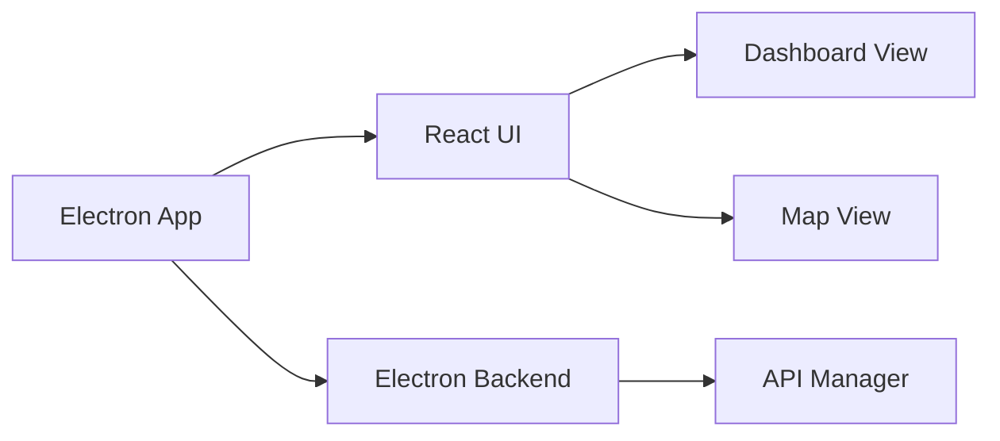

# Documentation Plan

1.  **Analyze the project structure:** Based on the file listing, identify the main components of the application (Electron, React UI, etc.).
2.  **Identify key modules and their relationships:** Use `list_code_definition_names` to explore the main modules (e.g., `src/ui/workbench.ts`, `src/electron/main.ts`) and understand how they interact.
3.  **Create a Mermaid diagram:** Create a diagram illustrating the project architecture, including the main components and their relationships.
4.  **Write a high-level description:** Write a textual description of the project architecture, explaining the purpose of each component and how they work together.
5.  **Update the `README.md` file:** Add the Mermaid diagram and the high-level description to the `README.md` file.

## Mermaid Diagram

This diagram shows the main components of the application:

*   **Electron App:** The main Electron application.
*   **React UI:** The React-based user interface.
*   **Electron Backend:** The Electron backend code.
*   **Dashboard View:** The main dashboard view.
*   **Map View:** The map view.
*   **API Manager:** The API manager module.