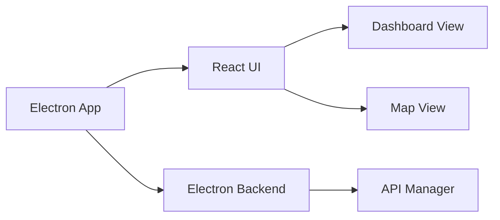

### Smart GCS

Smart GCS is a desktop application built with Electron and React. It provides a user interface for managing and visualizing data.

## Architecture

The application consists of the following main components:

*   **Electron App:** The main Electron application.
*   **React UI:** The React-based user interface.
*   **Electron Backend:** The Electron backend code.
*   **Dashboard View:** The main dashboard view.
*   **Map View:** The map view.
*   **API Manager:** The API manager module.

The following diagram illustrates the project architecture:



## Running the application

```bash

  npm install
  npm run dev

```
```